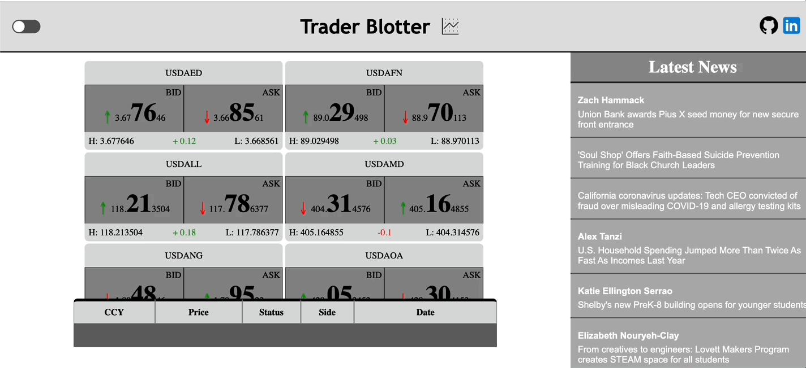

#  

An app where you can buy or sell foreign currency in real time.

* Watch exchange rates fluctuate in real time
* Learn about the highest and lowest rates of the day
* Perform buy/sell transactions on demand
* Integrated Newscatcher API to display the latest news from around the world

* NOTE: This app uses foreign currency fake data.

**Try it out here:**  [Trader Blotter](https://nathalia-lt.github.io/traderblotter/)


### Developed by:

* **Nathalia Troina**


# Demo:
 


 #

 ## Technical Accomplishments 

* Implemented Newscatcher API to fetch and display News data. 
* Designed and created interactive user interface with React and SCSS.


**Made With:** 

<a href="https://developer.mozilla.org/en-US/docs/Web/JavaScript" target="_blank" rel="noreferrer">  </a> 
<a href="https://reactjs.org/" target="_blank" rel="noreferrer">  </a> 
<a href="https://sass-lang.com/" target="_blank" rel="noreferrer">  </a> 

#

## How to Run This Application:
* Run the following commands in two seperate terminals:

```
// install and start the frontend interface
npm install 
npm start 
```
